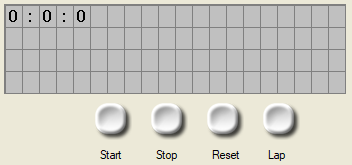
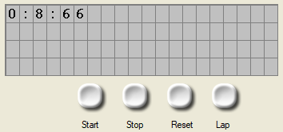
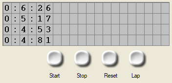

# ⏱️ Stopwatch Project

⚡ Built in <b>Flowcode</b>  
💻 Student at <b>Electrical Engineering High School</b>  
🌍 Passionate about electronics & embedded systems

---

## 🚀 About the Project
🔧 Stopwatch with start/stop and reset functions  
📟 Time display on LCD  
💡 Designed for microcontroller integration  

---

## 🛠️ Skills & Tools
<table>
  <tr>
    <td>⚡ Embedded programming</td>
    <td>🔌 Circuit design</td>
  </tr>
  <tr>
    <td>💻 Flowcode & Arduino</td>
    <td>🌐 Open‑source collaboration</td>
  </tr>
</table>

---

## 📸 Gallery

---

## 📫 Connect With Me

---

💡 <i>“Code + Cir
